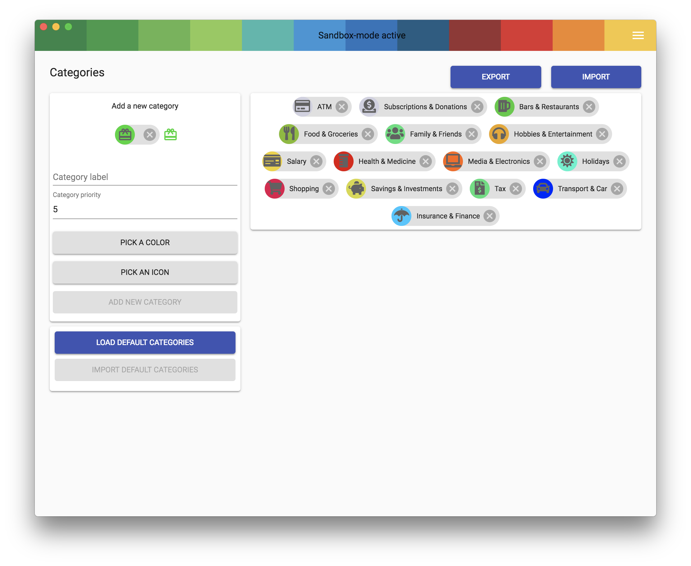

Categories are used to categories transactions based on [self configurable rules](category-rules.md). The categories will be shown on your payments history on the Dashboard and will also be used to create beatiful statistics on the statistics page.

Here are also some default categories included with bunqDesktop installation from version 0.9.0 onwards. But you can ofcourse delte them or recreate them or add your own categories.

To do this you will need to go to the categories section of bunqDesktop and there you can edit, delete and add them:

