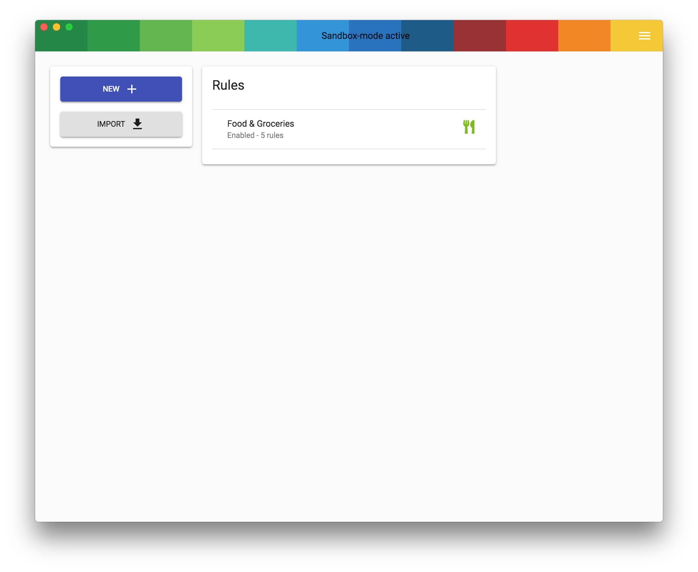
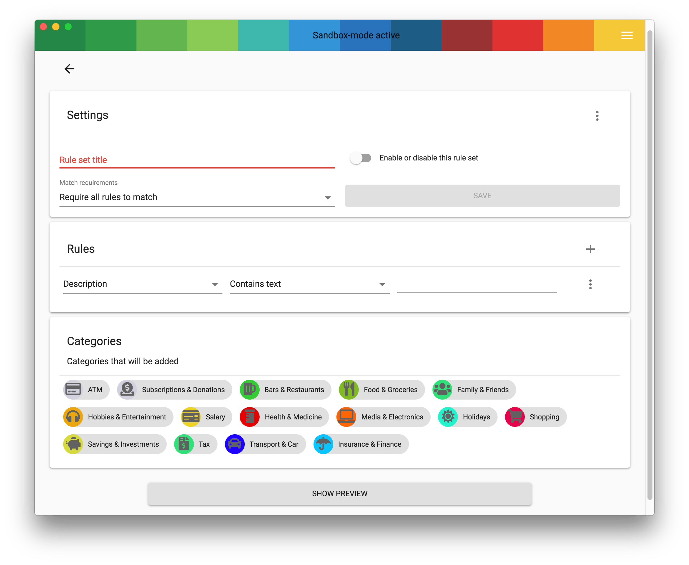

Rules are used to automatically add categories to payments this will help you to get a clearer view on what you are spending your money on.

You can add as many rules as you want. But remember a rule can also have multiple triggers so its possibly more usefull to just add more of them to one rule to keep a clean overview.

Using the rule editor you can add or edit rules there are different possibilities for adding rules you can create rules based on:

 - Display Name
 - IBAN
 - Discribtion
 - Other

 These then can have  a match type of the following:

  - Contains text
  - Matches exactly
  - Stats with
  - Ends with
  - Regex

You can then add one or more categories to the rule and using the show preview button see if you rule matches any payments in your account, this is a great way to test your rules and see if they work the way you want them to.

