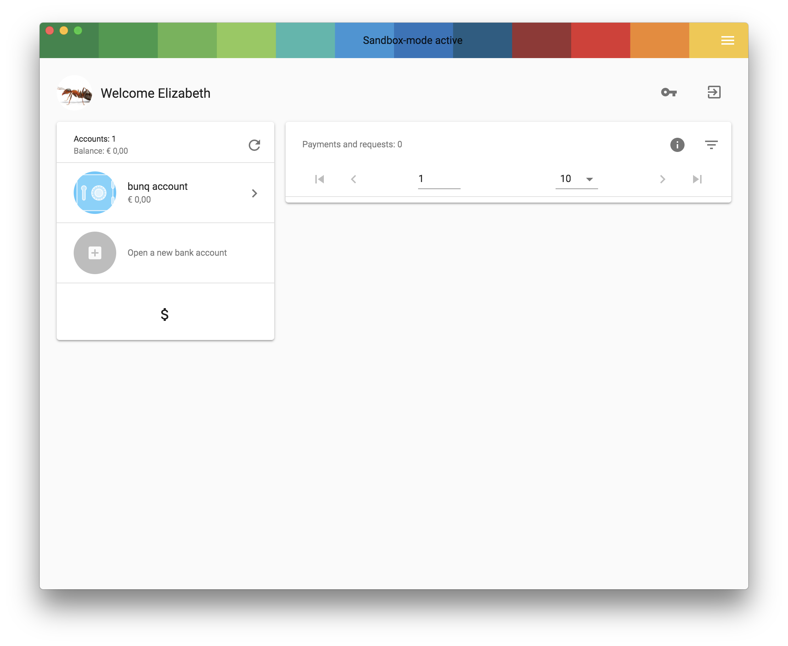
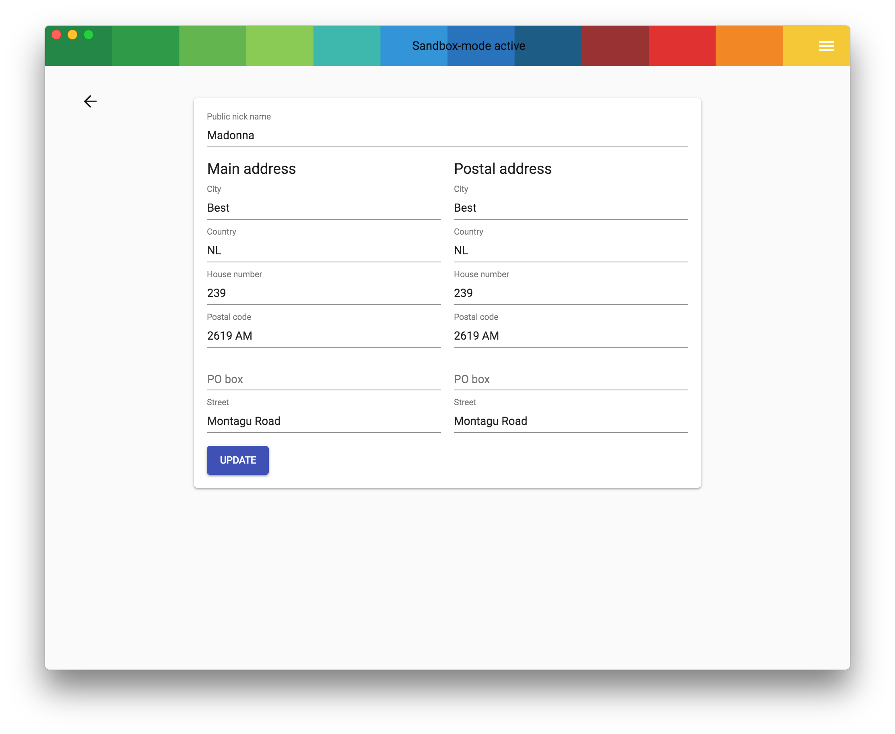

If you want to change your postal address from within the bunqDesktop application there are 4 easy steps you need to follow:
1. Go to the Dashboard
2. Click on your profile picture near your name
3. Change data to your liking
4. Save

Dashboard:

Change address screen:

