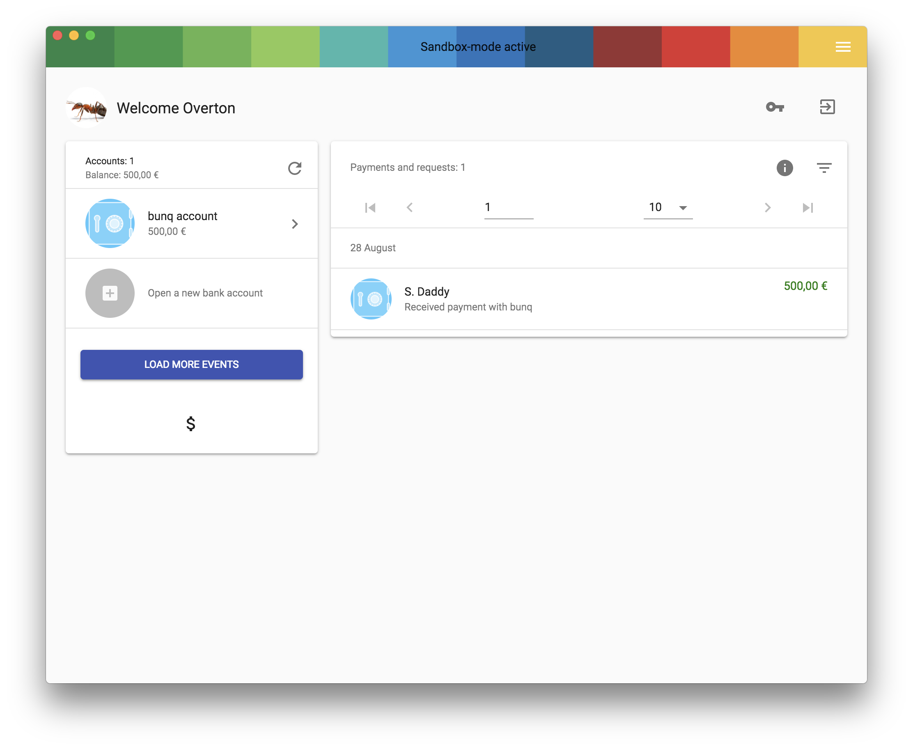

You can setup bunqDesktop to use a Sandbox account this way you can test the app and see if you like it without having to use your real account.

In order to do so you first have to startup a password when you first start bunqDesktop:

After that you will need to click onto the "more options" button:

In the submenu that apears you have to enable the "enable sandbox mode ?" toggle:

Then the last thing you will need to to is press the big "create sandbox account" button and you are done:

This will create a sandbox account and log you into it. Enjoy playing arround with the sanbox account.
