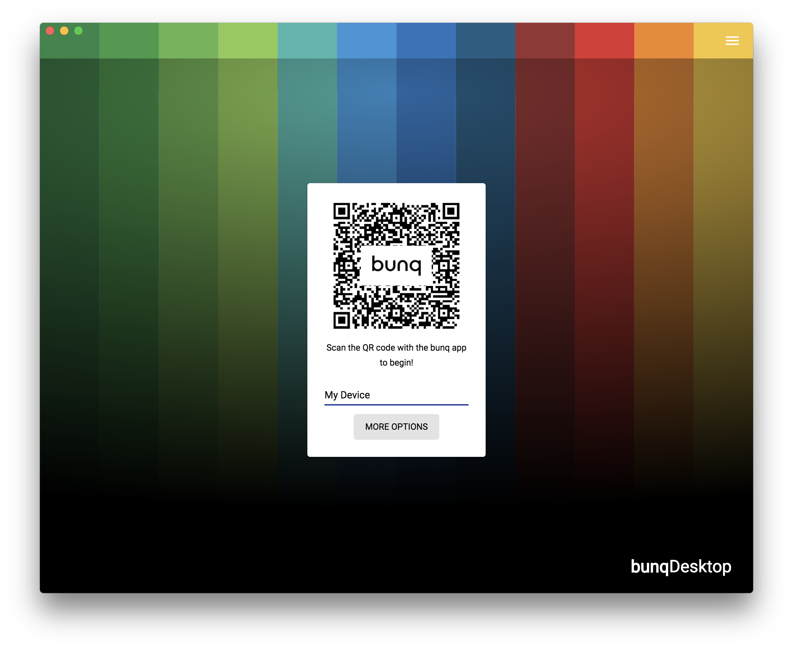

After [installing](installation.md) bunqDesktop you will need to follow these easy steps to get started:

1. Choose a secure password this password is used to encrypt your data.

2. Enter a device name this name will be shown in your bunq app under the security -> Api settings.
3. Scan the QR code with your bunq app on your phone.

4. Enable the toggle and perform the handrecogniction or type your phasphrase in the bunq app to confirm the login setup

5. Enjoy bunqDesktop 🎉
